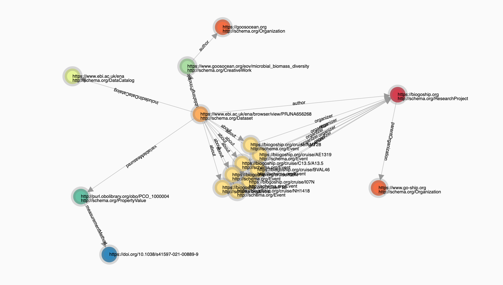

# jsonld-viz

JavaScript library for visualizing JSON-LD graphs. See demo at <https://pieterprovoost.be/jsonld-viz/>.

## How to use

See <https://github.com/pieterprovoost/jsonld-viz/tree/master/docs>.